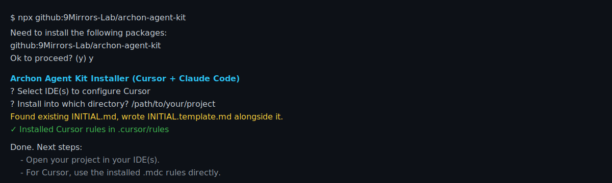

# Archon Agent Kit (Cursor + Claude Code)

This kit integrates Archon MCP with Cursor and Claude Code to drive a full PRP workflow: research → plan (PRP) → implement → validate. It installs IDE-specific rules/commands that use Archon as the source of truth for tasks, documents, and research.

> Scaffold agent-based PRP workflows for [Archon](https://github.com/coleam00/Archon) in Cursor and Claude Code.

This tool bootstraps **Archon-compatible rules**, **PRP scaffolds**, and **agent-ready templates** using a simple interactive CLI. It’s designed to work with the official [Archon MCP project](https://github.com/coleam00/Archon) and helps teams set up PRP development flows quickly and consistently.

Currently supports:
- ✅ Cursor IDE (via `.cursor/rules/*.mdc`)
- ✅ Claude Code (via `.claude/commands/ArchonAgentKit/*.md`)
- ✅ Dynamic PRP base generation based on detected tech (e.g., Next.js, FastAPI)

> Use this with a running Archon MCP instance for project-level research, planning, execution, and validation.

---

## 🚀 Why Archon Agent Kit?

This CLI helps you:
- Set up project-specific rules for PRP generation and execution
- Bootstrap reusable patterns into your IDE
- Detect tech stack and generate matching base templates
- Save and sync PRPs with Archon’s agent ecosystem

It replaces manual PRP setup and brings everything into a repeatable, IDE-native flow.

---

## 🛠️ What It Installs

| Component                  | Installed To                                              |
|---------------------------|-----------------------------------------------------------|
| PRP base + quickstart     | `INITIAL.template.md`, `README-PRP.md`                   |
| Cursor rules              | `.cursor/rules/*.mdc`                                     |
| Claude Code commands      | `.claude/commands/ArchonAgentKit/rules/*.md`              |
| Vendored fallback assets  | `archon-agent-kit/assets/agent-kit/` (if bootstrap missing) |

---

## ⚙️ Requirements

- [Archon MCP](https://github.com/coleam00/Archon) server running (default: `http://localhost:8051`)
- Cursor or Claude Code installed + configured to use MCP

---

## 📦 Installation

### ▶️ Interactive (Recommended)

```bash
# Local
node archon-agent-kit/bin/prp.js

# OR via npx:
npx archon-agent-kit
# or from GitHub
npx github:your-org/archon-agent-kit
```

Next steps:
- Open your project in your IDE(s).
- For Cursor, use the installed .mdc rules directly.
- For Claude Code, open the Commands panel and look under ArchonAgentKit/rules.

#### Setup (Interactive Example)


You'll be prompted to:
- Select IDE(s): Cursor and/or Claude Code
- Choose a target directory
- Inject PRP scaffolds and IDE rules
---

## 🧠 How It Works with Archon

This kit connects to your Archon MCP instance and maintains the current process in Archon:

- **Task Management**: Create, track, and update PRP-based tasks
- **Document Creation**: Generate and sync PRPs (`document_type="prp"`)
- **RAG + Code Examples**: Ask questions scoped to project context
- **Validation Flow**: Automate execution checks in 4 progressive layers

---

## 🌀 PRP Workflow 

1. **Prepare Context**
   - Edit `INITIAL.md`: add project name, feature, docs, and tech hints

2. **Generate Base Template**
   - Detects tech from `INITIAL.md`
   - Writes `PRPs/templates/prp-base-{tech}.json`
   - Saves a base PRP to Archon (`document_type="prp"`)

3. **Create Feature PRP**
   - Prompts or extracts implementation details
   - Outputs: PRP draft with paths, phases, gotchas, and validation stages

4. **Execute PRP**
   - Uses `execute-prp` rule to run tasks in order
   - Auto-validates (syntax → unit → integration → security)
   - Updates task states via Archon

5. **Review + Reuse**
   - View saved PRPs in Archon
   - Reuse and remix agent-generated patterns across projects

---


## 🧰 Using in IDEs

### Cursor

```bash
# Example usage in `.cursor/rules/`
generate-base-template.mdc PRPs/INITIAL.md
create-prp.mdc PRPs/INITIAL.md
execute-prp.mdc PRPs/feature-prp.md
```

> Requires Archon MCP connection.

---

## 🧠 Tech Stack Detection (PRP Tuning)

The base PRP adapts to your stack by analyzing:

- Framework mentions (Next.js, FastAPI, Rust)
- Docs links (nextjs.org/docs, docs.rs, etc.)
- File structure hints (e.g., `app/page.tsx`, `src/main.py`)

Result:
- PRPs/templates/prp-base-{tech}.json
- Archon document saved for team reuse

---

## 📚 Supported PRP Base Templates

Generated files follow: `PRPs/templates/prp-base-{tech}.json` and use PRP JSON schema version `1.0`.

Examples of `{tech}` identifiers this kit supports out‑of‑the‑box (selected by detection):

- Frontend: `nextjs`, `react`, `vue`, `svelte`, `remix`, `angular`
- Backend: `fastapi`, `express`, `django`, `flask`, `spring`, `dotnet`
- Mobile: `react-native`, `flutter`, `swift`, `kotlin`
- CLI: `click`, `typer`, `commander`, `argparse`, `clap`
- Data layer: `postgresql`, `mongodb`, `redis`, `sqlite`, `prisma`, `drizzle`
- Languages/Platforms: `python`, `rust`, `node`

For multi‑stack projects, the primary `{tech}` is chosen based on the strongest signals in `INITIAL.md` (framework mentions, docs links, and file patterns).

---

## 📁 Project Notes

- Supports Cursor and Claude only
- Fully self-contained: vendored assets fallback if bootstrap folder is missing
- Built specifically for the official [coleam00/Archon](https://github.com/coleam00/Archon) repo

---

## 🔜 Coming Soon

- Subagent scaffolding
- Claude slash command builder
- Custom rule injection via prompt

---

## 💻 Repo Setup (For Maintainers)

To publish:
1. Push to GitHub as `archon-agent-kit`
2. Ensure `package.json` includes `bin` field and correct name
3. Users can run:
```bash
npx github:your-org/archon-agent-kit
```

---

## 👋 Get Involved

Want to contribute subagent templates or new rules?  
Open an issue or PR at: [github.com/9Mirrors-Lab/archon-agent-kit](https://github.com/9Mirrors-Lab/archon-agent-kit)
